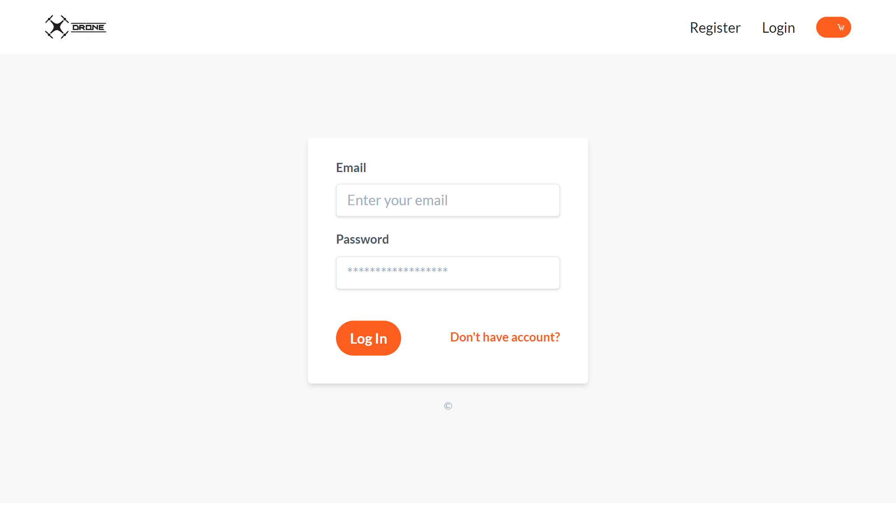
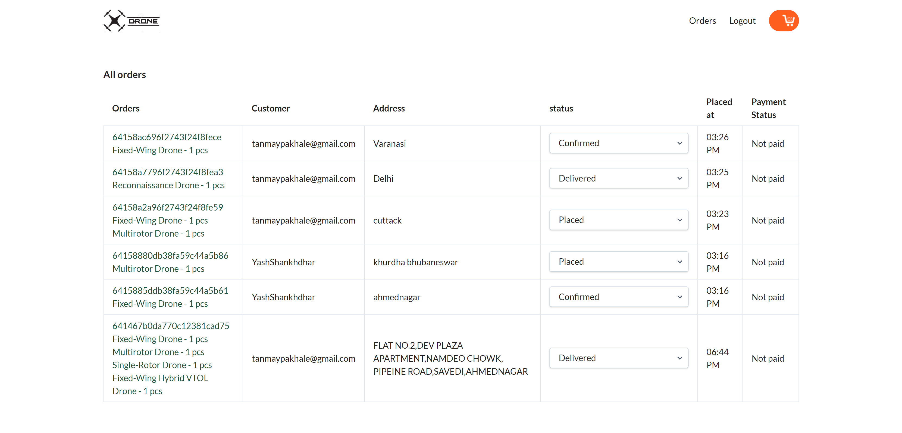
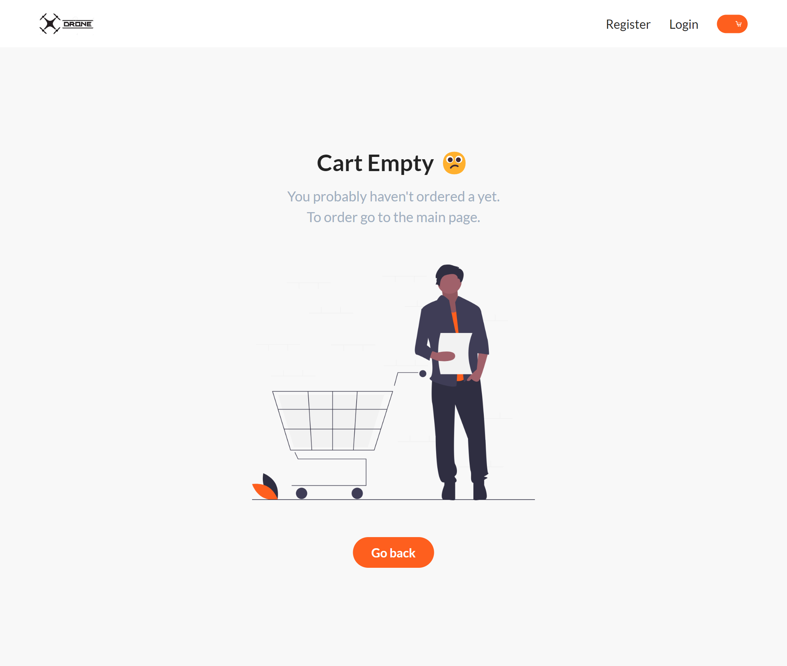
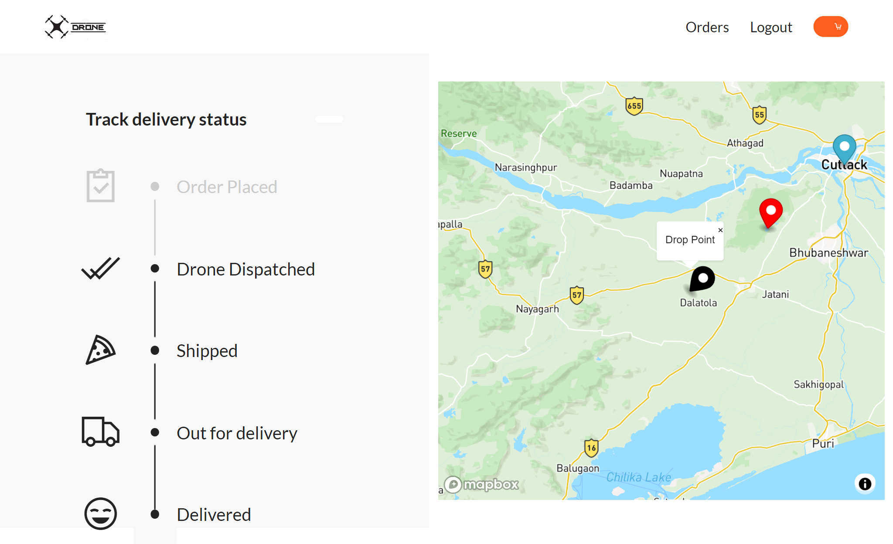
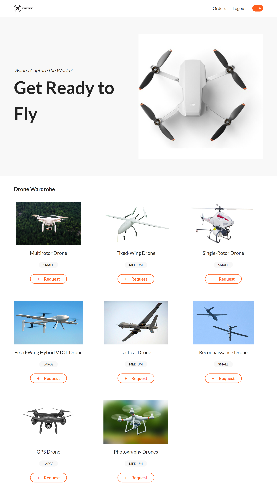
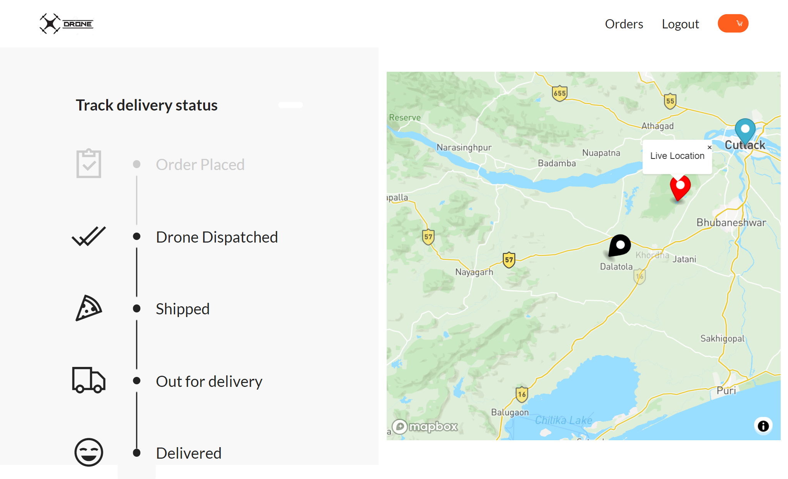
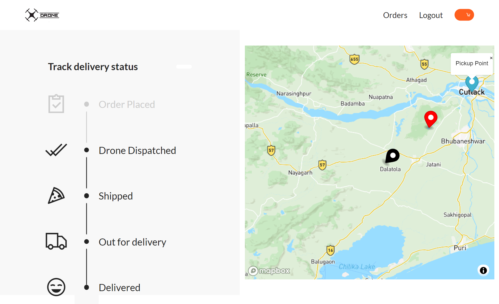
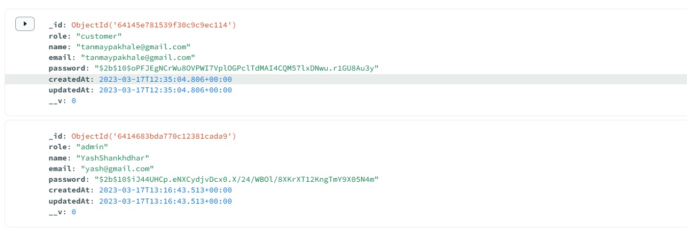

# General Champioship 2023 - Webathon solution

This is a solution to the [GC 23 - Webathon](https://drive.google.com/drive/folders/11ezwQIoYd56U09MbHllvizSgNRDs1rqe?usp=share_link).

## Table of contents

- [Overview](#overview)
  - [The challenge](#the-challenge)
  - [Screenshot](#screenshot)
  - [Links](#links)
- [My process](#my-process)
  - [Built with](#built-with)
- [Author](#author)

## Overview

### The challenge

### User side functionalities:
- Registration and Login: Users should be able to create an account and log in to the
application using their email.
- Request a Drone: Users should be able to select the pickup and delivery points on the
map and submit a request for a drone delivery.
- Real-Time Tracking: Users should be able to track their package in real-time once a
drone has been dispatched. The application should provide users with notifications when
the drone is on its way to the pickup location and when it reaches the pickup and
delivery locations.
- Package History: Users should be able to view their past delivery requests and track
their status.
### Admin side functionalities:
- Dashboard: Admins should be able to view all current delivery requests on the
dashboard.
- Accept or Reject Requests: Admins should be able to accept or reject delivery requests
based on drone availability or any other constraints.
- Master Map: Admins should be able to view a master map of all active drones in service
and track their location in real-time.
- Package History: Admins should be able to view past delivery requests and track their
status.
- For ease, the total number of drones can be taken as 5. Additional points shall be given
if the functionality for increasing or decreasing the number of drones is provided in the
admin portal.

### Screenshot

### Links

- Solution URL: [Github Repo](https://github.com/tanmaypakhale/gcwebathondronedelivery)

## My process

### Built with

- HTML5
- CSS3
- SASS
- Javascript
- Node.js
- [React](https://reactjs.org/) - JS library

## Contributors

- [Tanmay Pakhale](https://github.com/tanmaypakhale)
- [Yash V Shankdhar](https://github.com/YashShankhdhar04)
- [Abhishek Anand](https://github.com/scragonrex)
- [Sabyasachi Sahu](https://github.com/sahuSabya)